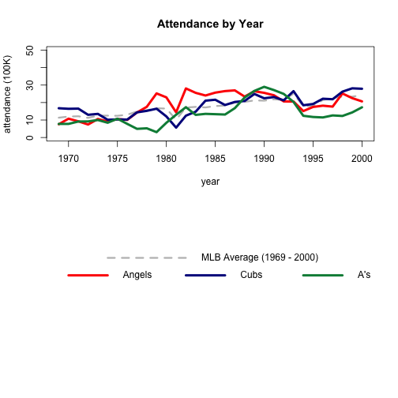

## Description of Application

- This application allows users to view statistics for Major League Baseball (MLB) teams over the period 1969 - 2000

- Data are viewable by MLB franchises that were in existence during that period (for reference, see [MLB Franchise History](https://en.wikipedia.org/wiki/Timeline_of_Major_League_Baseball)).

- Resultant plots are color coded by general team colors to allow easier inspection of the data. 

- Data for the entire period is plotted for the selected teams(s), but, in some cases (e.g. Blue Jays, Rockies, Marlins), the team came into existence sometime during 1969 - 2000. In these cases, data will only be plotted for the year the franchise existed.

---


Users may select any of the following teams


```
##  [1] "A's"           "Angels"        "Astros"        "Blue Jays"    
##  [5] "Braves"        "Brewers"       "Cardinals"     "Cubs"         
##  [9] "Diamond Backs" "Dodgers"       "Expos"         "Giants"       
## [13] "Indians"       "Mariners"      "Marlins"       "Mets"         
## [17] "Orioles"       "Padres"        "Phillies"      "Pirates"      
## [21] "Rangers"       "Rays"          "Red Sox"       "Reds"         
## [25] "Rockies"       "Royals"        "Tigers"        "Twins"        
## [29] "White Sox"     "Yankees"
```


Available statistics include: 

- Yearly attendance

- Total runs scored

- Total runs allowed

- Wins

---

## Example Plots



--- 

## More Information

- Data used for the application are associated with the UsingR library of the R programming language [UsingR](https://cran.r-project.org/web/packages/UsingR/) available from [Comprehensive R Archive Network](https://cran.r-project.org/). 

- Source code is available on  [GitHub](https://github.com/juanmarc/developing-data-products-project).

- A demo of the application can be found [here](https://juanmarc.shinyapps.io/developing-data-products-project/).
